# Local DNS Server & Web Hosting Setup using BIND and Apache

As part of my Linux Administration practice, I successfully configured a **DNS server (BIND)** and hosted a website using **Apache** inside a local network (LAN).

## ⚙️ What I Did
- Installed & configured **BIND (named)** service on Linux.  
- Created and deployed a forward zone file `mywebapp.com.fzone` with:
  - **SOA (Start of Authority)** record  
  - **NS (Name Server)** record  
  - **A (Address)** records for root domain & subdomain (www).  
- Updated `/etc/named.conf` with custom zone entry and added **Google & Cloudflare forwarders** for internet access.  
- Validated configuration using:  
  - `named-checkconf`  
  - `named-checkzone mywebapp.com /var/named/mywebapp.com.fzone`  

## 🌐 Testing & Validation
- Verified DNS resolution on Linux with `dig` & `nslookup`.  
- Configured a Windows client to use the DNS server (192.168.234.130).  
- Confirmed that both local domain (**mywebapp.com**) and external domains (e.g., google.com) resolved correctly.  

## 📂 Web Hosting
- Installed & configured **Apache**.  
- Deployed a custom `index.html` page under `/var/www/html/`.  
- Ensured correct permissions and service restart.  
- Successfully accessed the hosted site via browser:  
  - `http://mywebapp.com`  
  - `http://www.mywebapp.com`  

## 🎯 Key Skills Practiced
- Linux Server Administration  
- DNS Management (BIND)  
- Apache Web Server Hosting  
- Network Configuration & Troubleshooting (`dig`, `nslookup`)  
- Cross-platform validation (Linux ↔ Windows)  

## 🚀 Outcome
✅ Successfully deployed a private DNS + website hosting setup inside LAN.  
✅ Learned how to integrate DNS forwarders for seamless **internet + internal domain resolution**.  
✅ Hands-on practice as a **Linux Administrator** managing DNS & Web services.  

---

# 📸 Project Screenshots

## Screenshot 1: Installing BIND
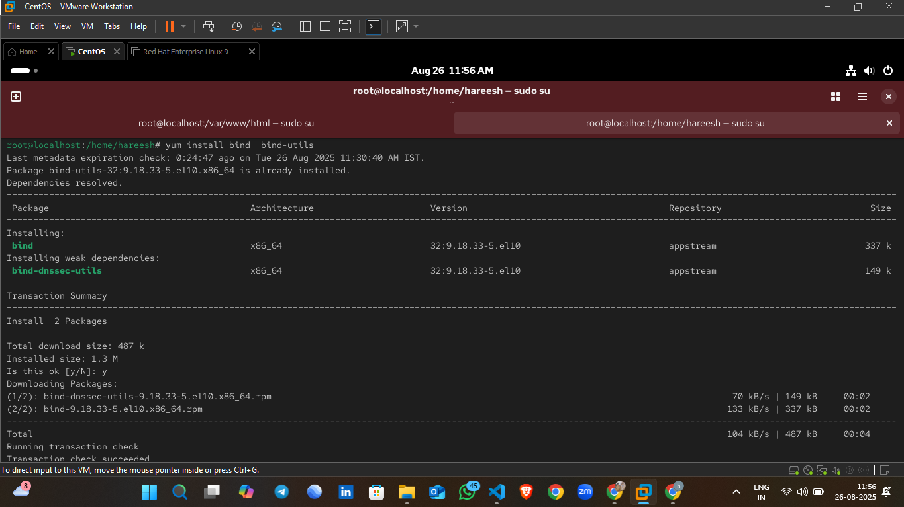

## Screenshot 2: Configuring named.conf
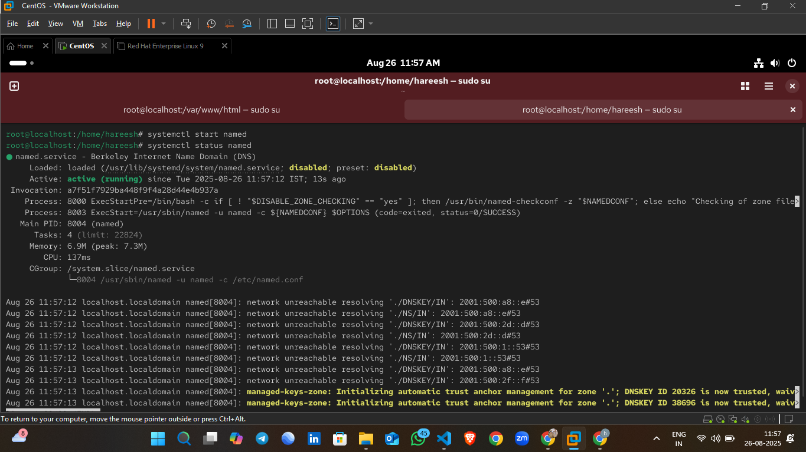

## Screenshot 3: Creating Zone File
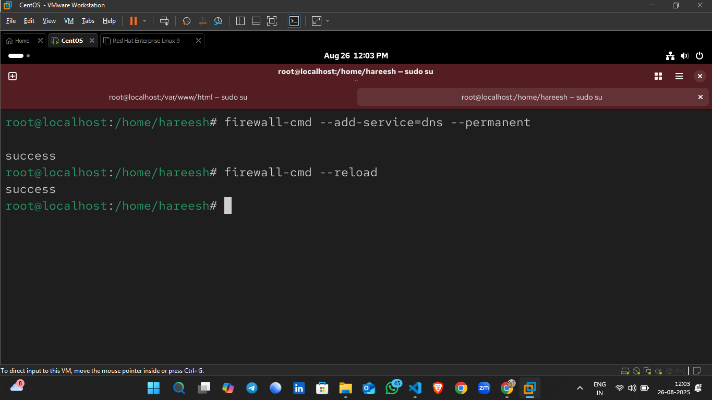

## Screenshot 4: Adding SOA & NS Records
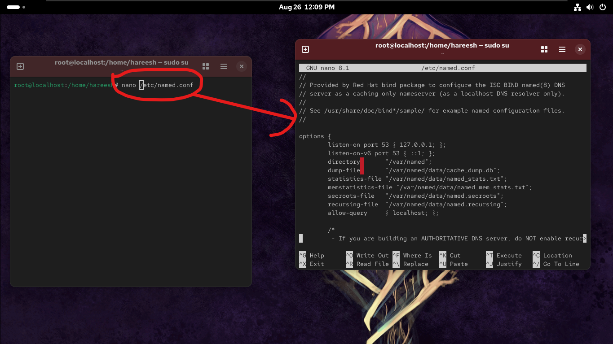

## Screenshot 5: Adding A Records
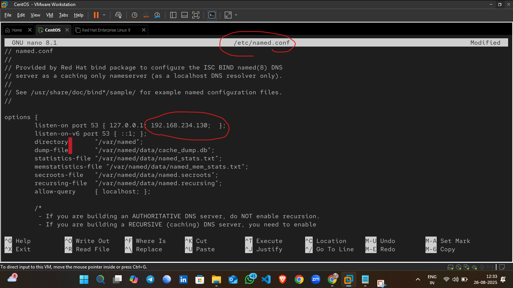

## Screenshot 6: Running named-checkconf
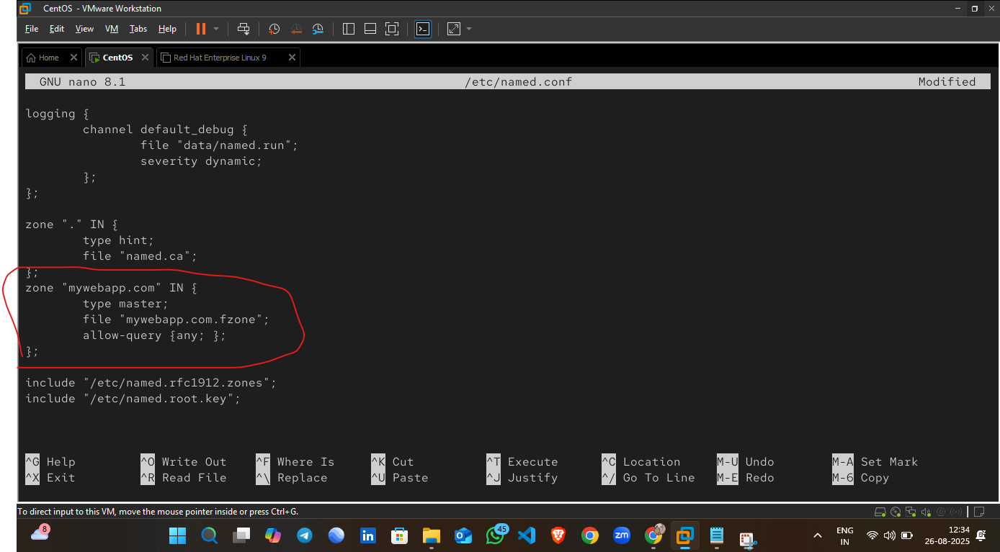

## Screenshot 7: Running named-checkzone
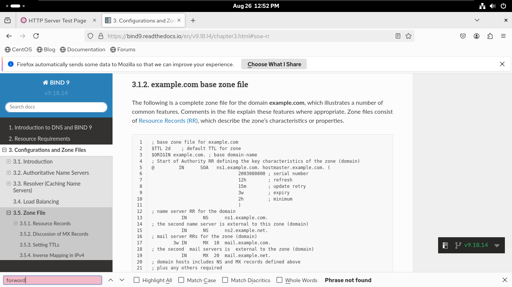

## Screenshot 8: Testing with dig
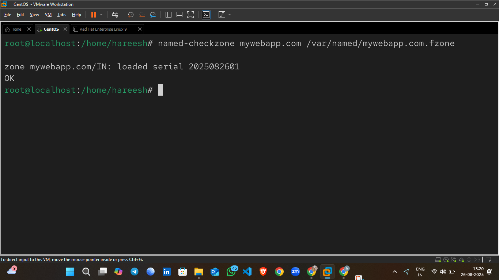

## Screenshot 9: Testing with nslookup
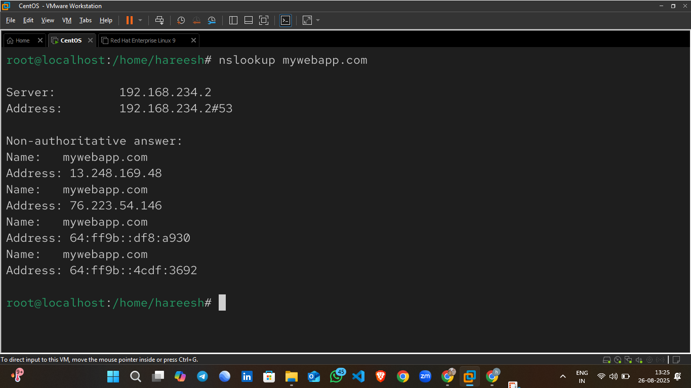

## Screenshot 10: Windows DNS Setup
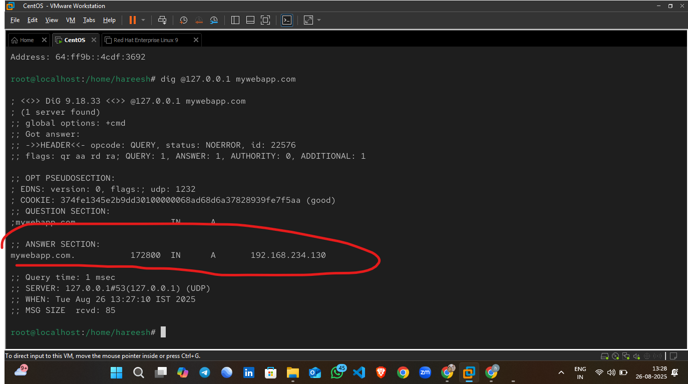

## Screenshot 11: Verifying mywebapp.com on Browser
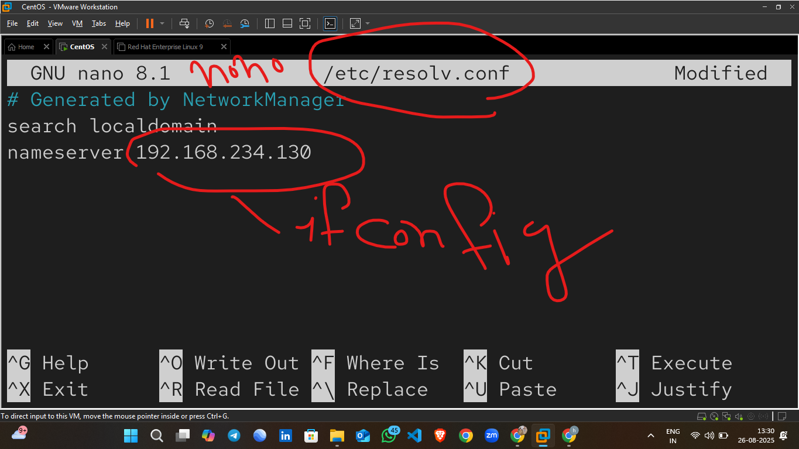

## Screenshot 12: Configuring Apache
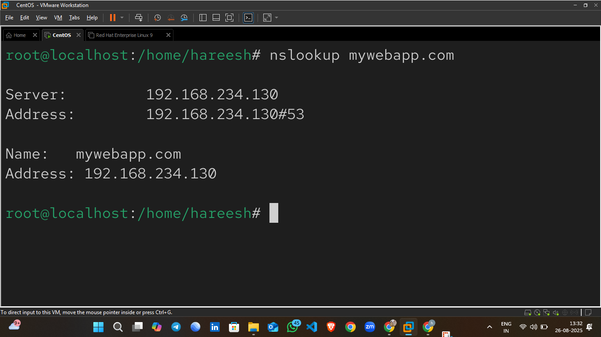

## Screenshot 13: Deploying index.html
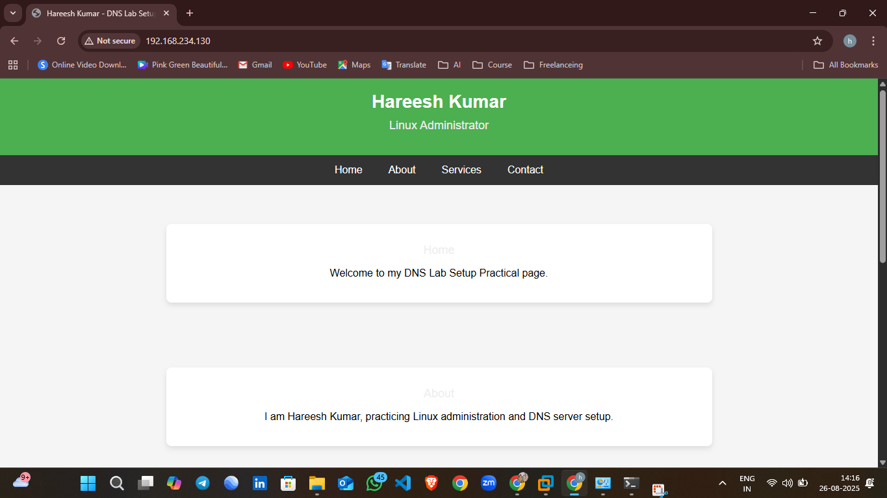

## Screenshot 14: Accessing Website via DNS
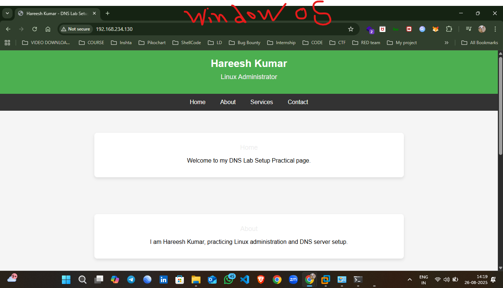

## Screenshot 15: Final Working Setup
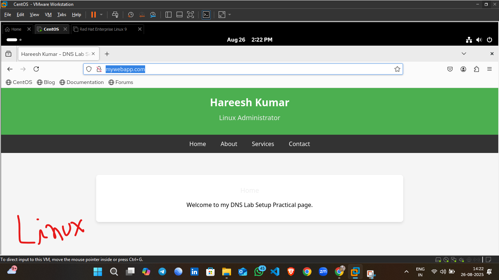

---

👉 Connect with me on LinkedIn: [Hareesh Kumar](https://www.linkedin.com/in/hareesh-kumar-02045a339/)
